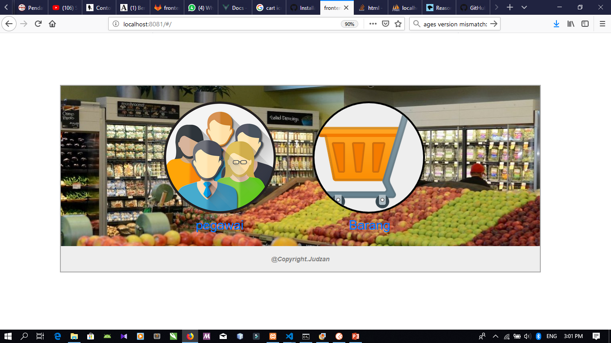
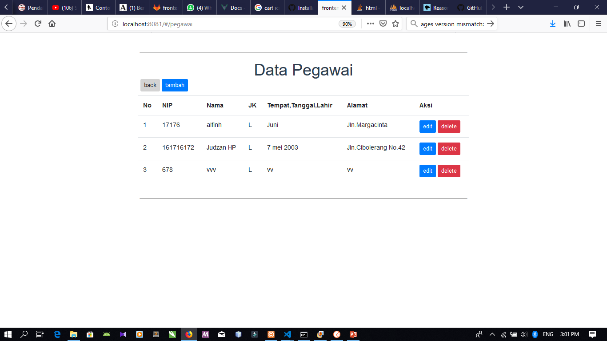
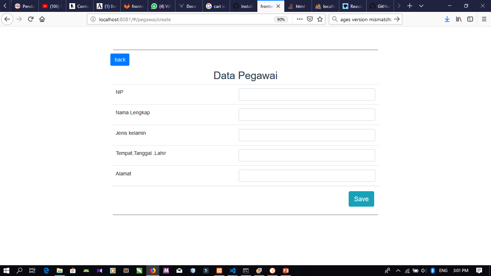

# TugasAkhir
Judz'an Hazim P

Aplikasi ini sebuah aplikasi simpel berbasis web yang dibuat menggunakan lumen untuk backend dan 
vue.js untuk frontend. Aplikasi digunakan untuk menyimpan data penting yang menyangkut  swalayan atau pasar modern.
Seperti : 
1. Data Barang
          
2. Data Pegawai
          


Your lumen project must use localhost:8080;

Steps : 


## Build Setup

``` bash
# install dependencies
npm install

# serve with hot reload at localhost:8080
npm run dev

# build for production with minification
npm run build

# build for production and view the bundle analyzer report
npm run build --report

# run unit tests
npm run unit

# run e2e tests
npm run e2e

# run all tests
npm test
```

For a detailed explanation on how things work, check out the [guide](http://vuejs-templates.github.io/webpack/) and [docs for vue-loader](http://vuejs.github.io/vue-loader).

# UI APLIKASI

## 1. Beranda
Beranda ini digunakan sebagai identitas web dan hal pertama untuk menarik seseorang dalam sebuah web.


## 2. Read Data (Fitur Pegawai)
Sebuah page yang berisi data data Pegawai yang didalamnya dapat melakukan sebuah crud.


## 3. Create Data (Fitur Pegawai)
Sebuah page form untuk melakukan sebuah penambahan data Pegawai dan lansung bertambah kedatabase.


## 4. Edit Data (Fitur Pegawai)
Sebuah page form untuk melakukan sebuah Perubahan han data Pegawai dan lansung berubah didatabasenya pun .


Dan ini sedikit penjelasan tentang aplikasi ini semoga membantu dan berguna bagi anda. 
